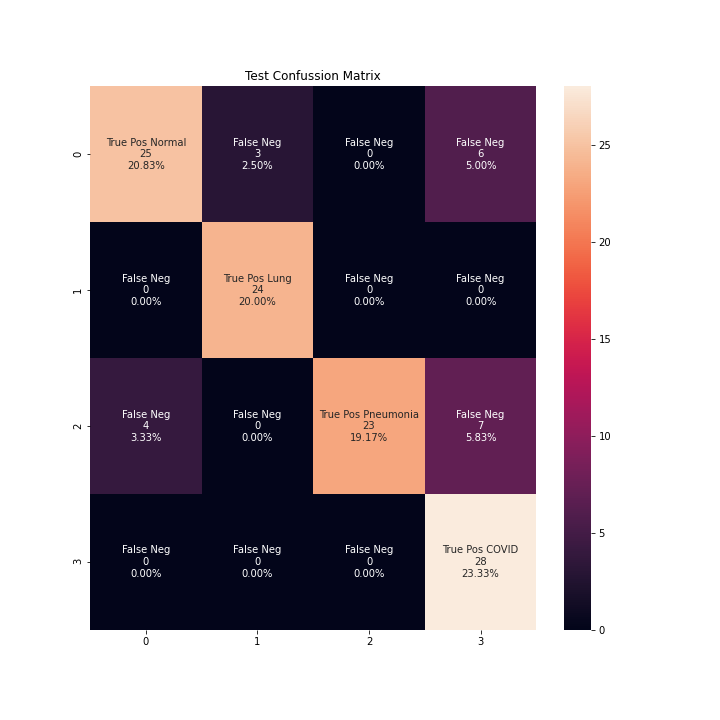

# COVID-19 detection with Chest-X-Ray using PyTorch and Flutter implementation

> Universidad Católica Boliviana "San Pablo" Regional La Paz. Av 14 de Septiembre Nº 4807 esquina calle 2 de Obrajes, La Paz - Bolivia

---
**Engineers developer team**  
---

Conchari Cabrera, Christian Ricardo

Jallaza Maldonado, Fabricio Alejandro

Quenta Alvarez, Hamed Emmerson

 

> Mechatronics Engineering La Paz, Bolivia

## Introduction
Nowadays, we are living in the COVID-19 pandemic, atypical COVID-19 infection case will damage the walls and linings of the air sacs in human lungs. As the human bodytries to fight it, the lungs become more inflamed and fill withfluid. In many cases, it is possible to perform imaging teststo support the diagnosis, determine the severity of the diseaseand assess therapeutic response. In this way, chest X-ray isusually the first imaging test in patients with suspected or confirmed COVID-19 because of its usefulness,  availability and low cost. As visual artificial learners we will generate a tool to support health professionals in the diagnosis of COVID-19 employing chest X-ray imaging tests.
There must be a high aplicability in the project and an app where it is connnected to the trained neural network and where a user can upload a X-Ray image of the lungs and get a prediction will be implemented. This will be developed in a Flutter framwork on the Dart programming language.

## Background
In order to setup a neural network adaptable to this project the Resnet networks are the most situable ones. With a 4 class data-set we chose the Resnet18 network. 

## Data Acquisition and Pre-processing
The dataset was obtained from [Kaggle](https://www.kaggle.com/tawsifurrahman/covid19-radiography-database). [6][7]

For the implementation of this project, the following 4-class dataset was used. A test set with 30 images of each class was set aside, in addition to a train set with 21045  images distributed as follows:

  
  

Subsequently, a contrast stretch was performed for all images before training the model, this in order to obtain a better visualization of features in images with low contrast.

  (a)
  
  (b)
  

Images from dataset (a) before, (b) after performing contrast stretching.

### Transfer Learning and Model Training
Once the data acquisition and preprocessing stage was carried out, several transformations were applied to the dataset, such as a Resize, a RandomHorizontalFlip and a  normalization. This was done using Pytorch dependencies. Subsequently, based on a transfer learning model, a ResNet18 neural network was implemented starting from a pre-trained model within Pytorch dependencies. By evaluating the predictions made by the model during the training, this process was continued until an accuracy of _0.95_ was obtained.

The training process was made under cpu and gpu with similar results but faster training process on the gpu side. It can be seen at:

[1. cpu_training.ipynb](https://github.com/ChristianConchari/COVID-19-detection-with-Chest-X-Ray-using-PyTorch/blob/master/1.%20cpu_training.ipynb)

[1. gpu_training.ipynb](https://github.com/ChristianConchari/COVID-19-detection-with-Chest-X-Ray-using-PyTorch/blob/master/1.%20gpu_training.ipynb)

### Model Compiling for Mobile Implementation
Once we have trained the  model, our next step will be toobtain a Torch Script capable of being loaded and used to makeinferences, either in a desktop Python environment or in a mobile environment with Dart and Flutter frameworks as is being done in the present project.

## Results
The results file can be seen at: 

[2. evaluation_metrics.ipynb](https://github.com/ChristianConchari/COVID-19-detection-with-Chest-X-Ray-using-PyTorch/blob/master/2.%20evaluation_metrics.ipynb)

In order to evaluate the project some  metrics  must  be obtained, these will be the most important feedback to the project and may be applied to the training or data augmentation part. In order to obtain the required metrics a data extraction must be made, the model on __.pt__ and __.pth__ format will be loaded and the important characteristics will be extracted from it. The relevant metrics for a ResNet-18 neural network are:
<table>
<tr>
<th></th>
<th>ResNet-18</th>
</tr>
<tr>
<td>

|__Pathology__|
|:-|
|Normal|
|Lung Opacity|
|Viral Pneumonia|
|COVID-19|
||
|Accuracy|
|Macro avg|
|Weighted avg
</td>
<td style="text-align: center;">

|Precision|Recall|F1-Score|Support|
|-:|-:|-:|-:|
|0.91|0.77|0.83|26|
|0.89|0.1.00|0.94|33|
|1.00|0.78|0.88|36|
|0.70|0.92|0.79|25|
|||||
|||0.86|120|
|0.87|0.85|0.85|120|
|0.88|0.86|0.85|120|

</td>

</tr>
<tr>
<td>

|TL;DR|
|:-|
|Train set|
|Test set|

</td>
<td>

|Total Correct Predictions|Total Accuracy|
|-:|-:|
|21045|86.49%|
|105|__83.33%__|

</td>

</tr>
<tr>
<td>Confusion Matrix</td>
<td>

</td>

</tr>
</table>

- __Localization with Gradient-based Class Activation Maps__

  

  

The gradient shows where the neural network model is looking and shows a concentration in the lungs.

- __Flutter App Implementation__

A mobile interface has been created using the Flutter framework, for this purpose we made use of the pytorch mobile library, which allows us to work loading the Pytorch script  generated with the information of the trained model, to make inferences taking as input images entered by the user and giving as output the corresponding classification label.

  

This figure shows a gradient prediction of the model

## Conclussions
In this project we have presented an implementation of a Convolutional Neural Network (CNN) model generated with Transfer Learning techniques, modifying the pre-trained ResNet18  network to classify chest X-ray images into four classes: normal lungs,  lungs infected with COVID-19, with viral pneumonia and pulmonary opacity. The current scenery in which  we find ourselves requires us to contribute through new solutions, in our case applying artificial intelligence to support the medical diagnosis of respiratory diseases such as COVID-19.

## Presentation Video
[![COVID-19 DETECTION WITH RESNET18, PYTORCH & FLUTTER]](https://www.youtube.com/watch?v=uAe7GDQCOfk)

## References
<a id="1">[1]</a> 
Shuzhan Fan (Nov 2,2018), M. Dietz, "Understand Deep Residual Networks — a simple, modular learning framework that has redefined…", Medium, 2021. [Online]. Available: (https://medium.com/@waya.ai/deep-residual-learning-9610bb62c355). [Accessed: 11- Jun- 2021]

<a id="2">[2]</a> 
. Feng, "An Overview of ResNet and its Variants", Medium, 2021. [Online]. Available: https://towardsdatascience.com/an-overview-of-resnet-and-its-variants-5281e2f56035. [Accessed: 11- Jun- 2021]

<a id="3">[3]</a> 
J. Prakash, "Understanding and Implementing Architectures of ResNet and ResNeXt for state-of-the-art Image…", Medium, 2021. [Online]. Available: 
    https://medium.com/@14prakash. [Accessed: 11- Jun- 2021]
    
<a id="4">[4]</a> 
M. Hussain, "What is Resnet or Residual Network | How Resnet Helps?", GreatLearning Blog: Free Resources what Matters to shape your Career!, 2021. [Online]. Available: https://www.mygreatlearning.com/blog/resnet/#:~:text=ResNet%2C%20short%20for%20Residual%20Network,Residual%20Learning%20for%20Image%20Recognition%E2%80%9D. [Accessed: 11- Jun- 2021]

<a id="5">[5]</a> 
He, K., Zhang, X., Ren, S., \& Sun, J. (2016). Deep residual learning for image recognition. In Proceedings of the IEEE conference on computer vision and pattern recognition (pp. 770-778).

<a id="6">[6]</a> 
M. E. H. Chowdhury et al., "Can AI Help in Screening Viral and COVID-19 Pneumonia?," in IEEE Access, vol. 8, pp. 132665-132676, 2020, doi: 10.1109/ACCESS.2020.3010287.

<a id="7">[7]</a> 
Rahman, A. Khandakar, Y. Qiblawey, A. Tahir, S. Kiranyaz, S. B. Abul Kashem, M.T. Islam, S. Al Maadeed, S. M. Zughaier, M. S. Khan, and M. E. Chowdhury, “Exploring the effect of image enhancement techniques on covid-19 detection using chest X-ray images, ”Computers in Biology and Medicine, vol. 132, p. 104319, 2021. [Online]. Available: https://www.sciencedirect.com/science/article/pii/S001048252100113X

<a id="8">[8]</a> 
"torch.jit.script — PyTorch 1.8.1 documentation", Pytorch.org, 2021. [Online]. Available: \url{https://pytorch.org/docs/stable/generated/torch.jit.script.html}. [Accessed: 11- Jun-2021]
