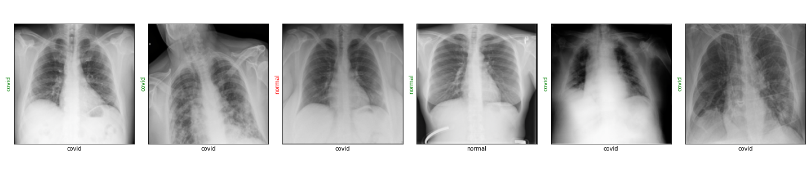
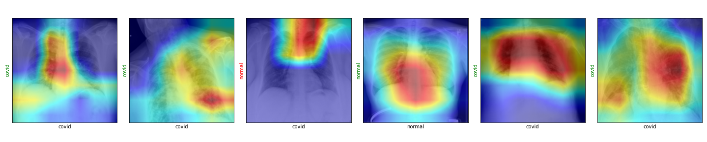

## Results

<table>
<tr>
<th></th>
<th>ResNet-18</th>
</tr>
<tr>
<td>

|__Pathology__|
|:-|
|Normal|
|Lung Opacity|
|Viral Pneumonia|
|COVID-19|

</td>
<td style="text-align: center;">

|Precision|Recall|F1-Score|Support|
|-:|-:|-:|-:|
|0.91|0.77|0.83|26|
|0.89|0.1.00|0.94|33|
|1.00|0.78|0.88|36|
|0.70|0.92|0.79|25|

</td>

</tr>
<tr>
<td>

|TL;DR|
|:-|
|Train set|
|Test set|

</td>
<td>

|Total Correct Predictions|Total Accuracy|
|-:|-:|
|21045|86.49%|
|105|__83.33%__|

</td>

</tr>
<tr>
<td>Confusion Matrix</td>
<td>

</td>

</tr>
</table>

- __Localization with Gradient-based Class Activation Maps__
> 

## Conclussions
## References
