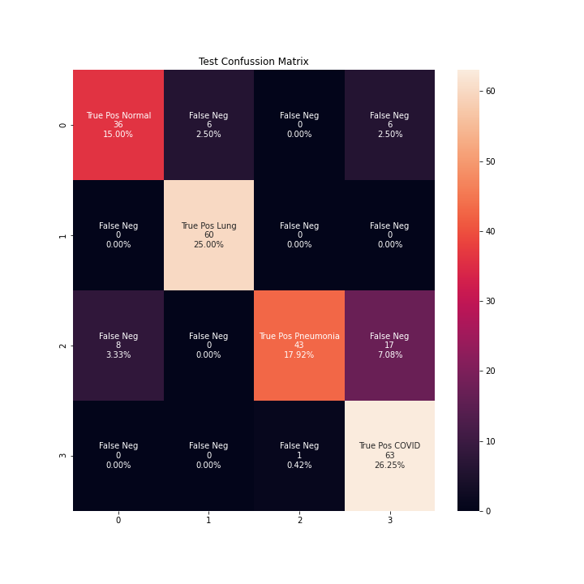
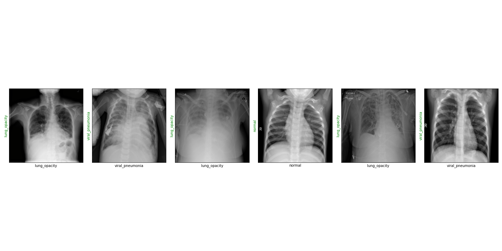
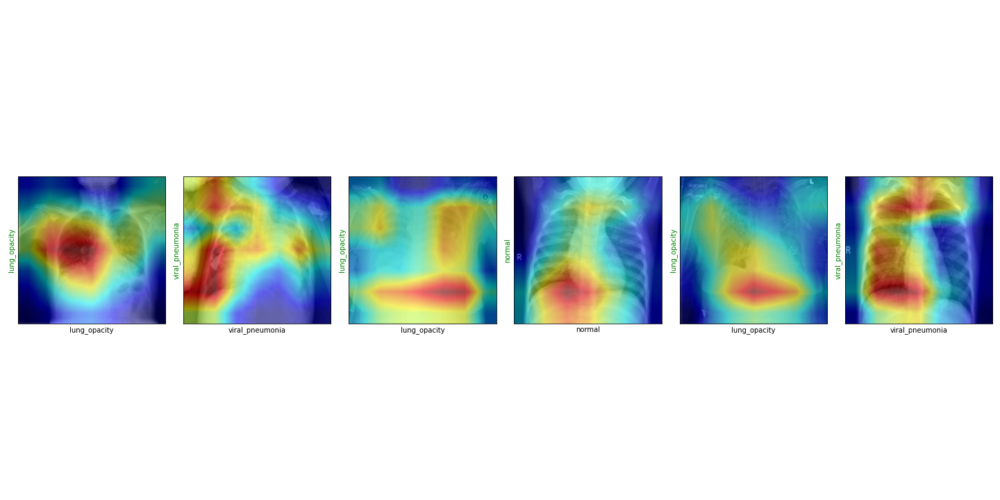

## Results

<table>
<tr>
<th></th>
<th>ResNet-18</th>
</tr>
<tr>
<td>

|__Pathology__|
|:-|
|Normal|
|Lung Opacity|
|Viral Pneumonia|
|COVID-19|

</td>
<td style="text-align: center;">

<table style="margin-left: auto; margin-right: auto;">
<thead>
  <tr>
    <th class="tg-0lax">Precision</th>
    <th class="tg-0lax">Recall</th>
    <th class="tg-0lax">F1-Score</th>
    <th class="tg-0lax">Support</th>
  </tr>
</thead>
<tbody>
  <tr>
    <td class="tg-0lax">0.91</td>
    <td class="tg-0lax">0.77</td>
    <td class="tg-0lax">0.83</td>
    <td class="tg-0lax">26</td>
  </tr>
  <tr>
    <td class="tg-0lax">0.89</td>
    <td class="tg-0lax">0.1.00</td>
    <td class="tg-0lax">0.94</td>
    <td class="tg-0lax">33</td>
  </tr>
  <tr>
    <td class="tg-0lax">1.00</td>
    <td class="tg-0lax">0.78</td>
    <td class="tg-0lax">0.88</td>
    <td class="tg-0lax">36</td>
  </tr>
  <tr>
    <td class="tg-0lax">0.70</td>
    <td class="tg-0lax">0.92</td>
    <td class="tg-0lax">0.79</td>
    <td class="tg-0lax">25</td>
  </tr>
</tbody>
</table>

</td>

</tr>
<tr>
<td>

|TL;DR|
|:-|
|Train set|
|Test set|

</td>
<td>

|Total Correct Predictions|Total Accuracy|
|-:|-:|
|21045|86.49%|
|105|__83.33%__|

</td>

</tr>
<tr>
<td>Confusion Matrix</td>
<td>

</td>

</tr>
</table>

- __Localization with Gradient-based Class Activation Maps__
> 

## Conclussions
## References
